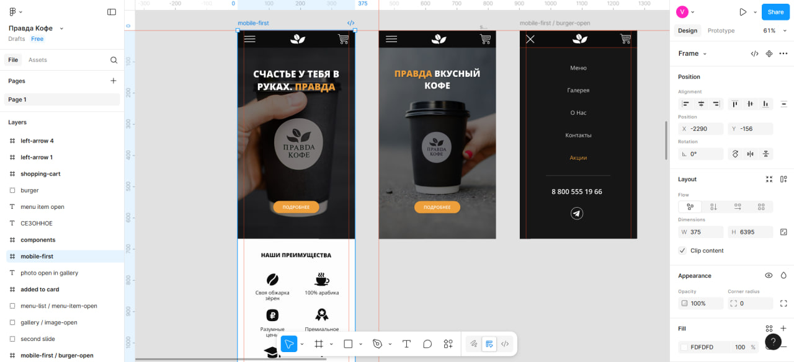
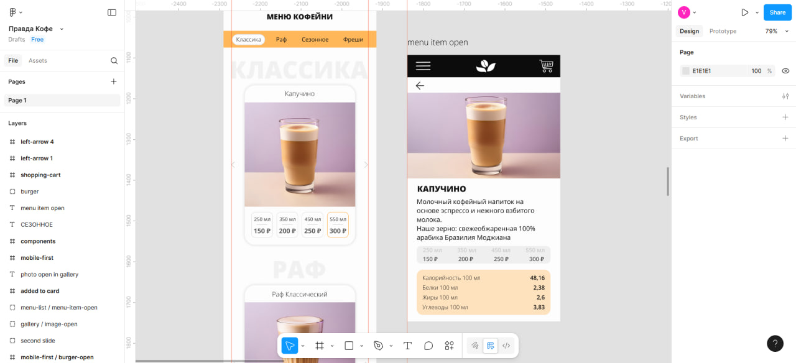
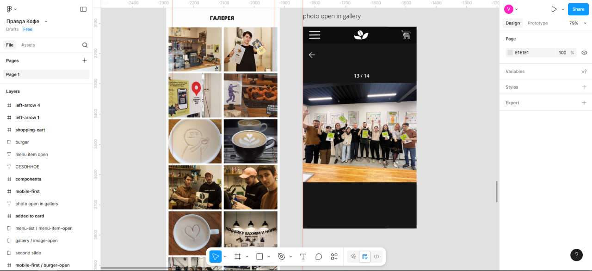
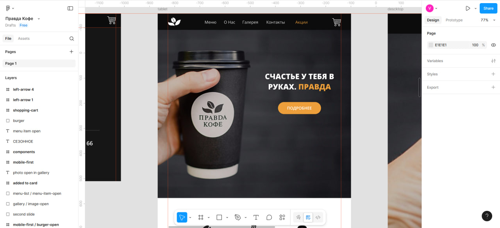
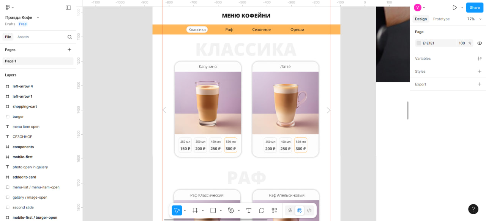
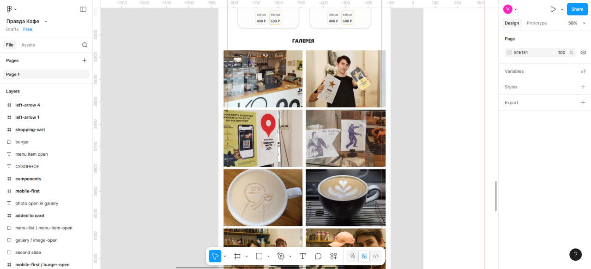
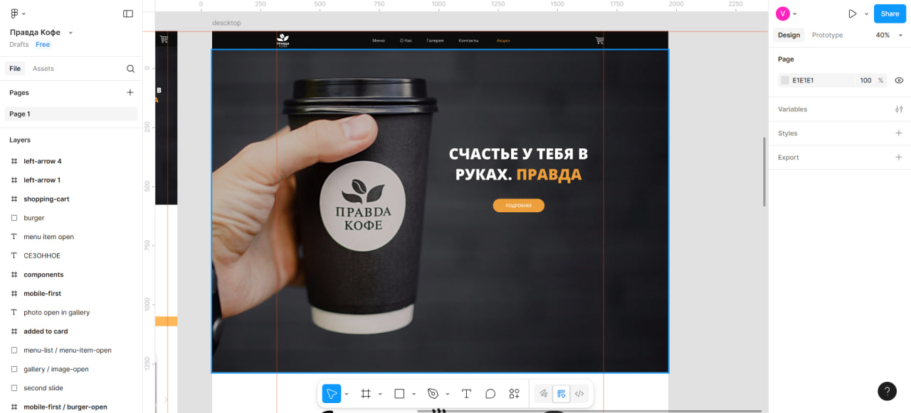
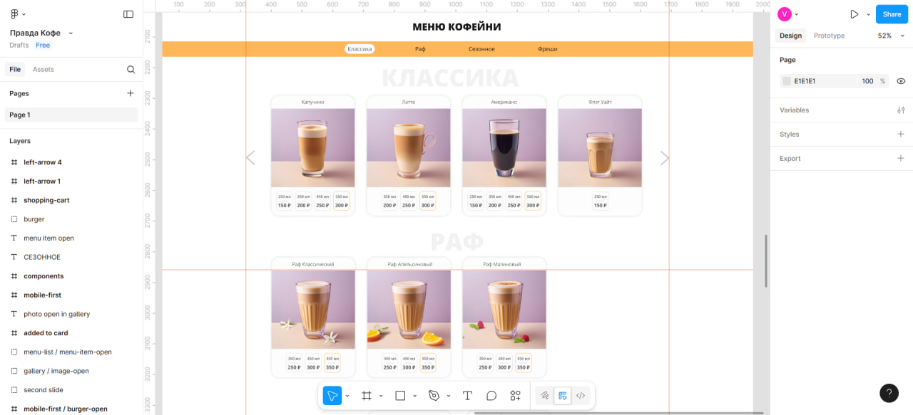
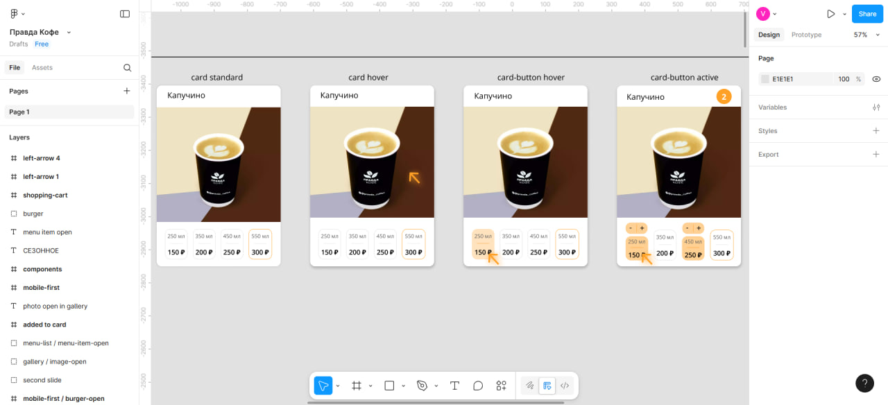

# Проект Pravda Coffee
  - Веб-приложение кофейни, демонстрирующее навыки работы с React, Tailwind css, архитектурой FSD

## Технологии:
    - React + Vite
    - Tailwind css (mobile first)
    - FSD

## Скриншоты (figma)
  ### Mobile first:
  
  
  
  ### Tablet:
  
  
  
  ### Descktop:
  
  
  ### Карточки товаров (состояния):
  
## Скриншоты (layout):
